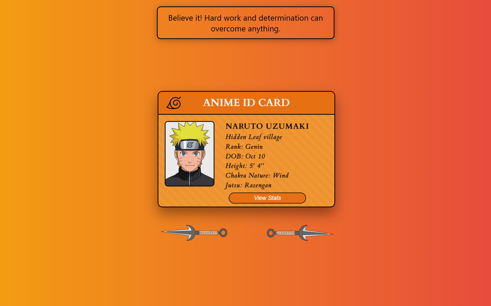

# Anime Digital ID Card 🌀

  

Interactive flip cards featuring Naruto characters with unique designs, stats, and animations.

## Table of Contents
- [Features](#features)
- [Demo](#demo)
- [Installation](#installation)
- [Usage](#usage)
- [Characters](#characters)
- [Tech Stack](#tech-stack)
- [Project Structure](#project-structure)
- [Website Link](#website-link)

## Features

- **4 Complete Character Cards**:
  - Naruto Uzumaki
  - Sasuke Uchiha
  - Sakura Haruno
  - Kakashi Hatake

- **Interactive Elements**:
  - Click-to-flip animation showing character stats
  - Character-specific quotes displayed on page load based on body class
  - Navigation kunai buttons

- **Design Highlights**:
  - Unique color schemes for each character
  - Smooth CSS animations and transitions

## Demo

Live Demo: 


## Installation

1. Clone the repository:
   ```bash
   git clone https://github.com/asmath-akbar-ali/Anime-Digital-ID-Card.git

2. Navigate to the project directory:
   ```bash
   cd Anime-Digital-ID-Card

3. Open index.html in your browser.

## Usage

- Click on any character card to flip and view stats.
- The quote for the selected character is displayed on page load based on the body class.

## Characters

- **Naruto Uzumaki** — The energetic ninja with a never-give-up attitude.
- **Sasuke Uchiha** — The lone avenger walking his own path.
- **Sakura Haruno** — The strong and compassionate ninja.
- **Kakashi Hatake** — The wise and mysterious sensei.

## Tech Stack

- **HTML5**
- **CSS3** (Flexbox, Transitions, Animations)
- **JavaScript (ES6)**

## Project Structure
```bash
anime-digital-id-cards/
├── index.html
├── sasuke.html
├── kakashi.html
├── sakura.html
├──style.css
├──script.css
├──images/
```

## Website Link

Link: https://anime-digital-id-card.vercel.app/
